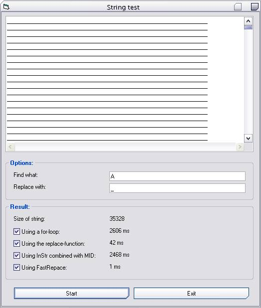

## A fast replace\-function

### Description

The Replace-function in VB6 is an extremely useful in many occasions, but unfortunately, it is as most string-functions in VB rather slow. Therefore I&#8217;ve tried to optimize this operation, and I must say the result is satisfying &#8211; it is nearly 50 times faster replacing 35.000 characters than the native Replace-function.

The code should also work in VB5, where the native function doesn&#8217;t even exist.
 
### More Info
 
As Replace in VB6, only that "Start" is now defining the position within the expression where the substring search is to begin.

The string replaced.

             |
---                |---
**Submitted On**   |2005-05-20 23:20:18
**By**             |[Kristian S\. Stangeland](https://github.com/Planet-Source-Code/PSCIndex/blob/master/ByAuthor/kristian-s-stangeland.md)
**Level**          |Advanced
**User Rating**    |5.0 (65 globes from 13 users)
**Compatibility**  |VB 5\.0, VB 6\.0
**Category**       |[String Manipulation](https://github.com/Planet-Source-Code/PSCIndex/blob/master/ByCategory/string-manipulation__1-5.md)
**World**          |[Visual Basic](https://github.com/Planet-Source-Code/PSCIndex/blob/master/ByWorld/visual-basic.md)
**Archive File**   |[A\_fast\_rep1890335212005\.zip](https://github.com/Planet-Source-Code/kristian-s-stangeland-a-fast-replace-function__1-60605/archive/master.zip)

